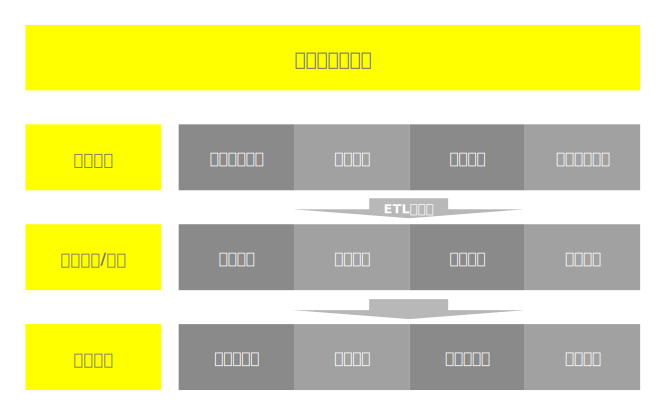

为什么 - 设场景 - 提思路 -  - 大环境


怎么做

做什么

做更好


# 一、产品上线后经常离不开一个词，数据分析

## 1.1 为什么要数据分析

- 满足硬性指标，比如分析用户量，访问量，点击量，转化率。

- 了解用户行为，比如用户的使用习惯，用户的决策路径，用户的注意力分布。

- 掌握产品动向，比如产品使用量，产品所处的生命周期，线上的应用表现。

- 支持产品决策，比如规划上线新功能，迭代优化旧功能。

- ......

那么要如何进行数据分析呢？分析哪些问题？是找问题还是验证？关于这些问题需要哪些数据？这些数据从哪里来？要怎么解决这些问题呢？

答案是，数据埋点。

## 1.1 数据的生命周期



四个阶段分别是，数据采集、数据预处理、数据挖掘/分析、数据应用。

### 1.1.1 数据采集

数据的事情归结起来就两点：数据采集和数据分析。

数据采集的基本原则是全和细。

- 全就是把多种数据源都进行采集，而不只是客户端的用户数据。

- 细就是强调多维度，把事件发生的一系列维度信息，比如订单运费、成本价格等，尽量多的记录下来，方便后续交叉分析。


埋点行为数据：通过埋点的方式，采集到的一些行为数据，如浏览、点击、停留时长等；

业务数据：伴随着业务产生的数据，核心是生产系统内存储的业务表单数据；

日志数据：一般是Web端日志记录的数据；

外部接入数据：从第三方获得的数据。

#### 1.1.1.1 第三方

第一种直接使用友盟、百度统计这样的第三方统计工具，嵌入 App SDK 或 JS SDK，来直接查看统计数据。这种方式的好处是简单、免费，因此使用非常普及。

对于看一些网站访问量、活跃用户量这样的宏观数据需求，基本能够满足。对于现在一些涉及订单交易类型的产品，仅仅宏观的简单统计数据已经不能满足用户的需求了。

更加关注一些深度的关键指标分析，例如：用户渠道转化、新增、留存、多维度交叉分析等。这个时候才发现第三方统计工具很难满足对数据的需求，而出现这样的问题并不是因为工具的分析能力薄弱，而是因为这类工具对于数据采集的不完整。

通过这种方式 SDK 只能够采集到一些基本的用户行为数据，比如设备的基本信息，用户执行的基本操作等。但是服务端和数据库中的数据并没有采集，一些提交操作，比如提交订单对应的成本价格、折扣情况等信息也没有采集，这就导致后续的分析成了“巧妇难为无米之炊”。

通过客户端 SDK 采集数据还有一个问题就是经常觉得统计不准，和自己的业务数据库数据对不上，出现丢数据的情况。这是前端数据采集的先天缺陷，因为网络异常，或者统计口径不一致，都会导致数据对不上。

#### 1.1.1.2 业务数据库

第二种是直接使用业务数据库做统计分析，一般的互联网产品，后端都有自己的业务数据库，里面存储了订单、用户注册信息等数据，基于这些数据，一些常用的统计分析都能够搞定。

这种方式天然的就能分析业务数据，并且是实时、准确的。

但不足之处有两点：

一是业务数据库在设计之初就是为了满足正常的业务运转，给机器读写访问的。为了提升性能，会进行一些分表等操作。
一个正常的业务都要有几十张甚至上百张数据表，这些表之间有复杂的依赖关系。这就导致业务分析人员很难理解表含义。
即使硬着头皮花了两三个月时间搞懂了，隔天工程师又告诉你因为性能问题拆表了，你就崩溃了。

另一个不足之处是业务数据表的设计是针对高并发低延迟的小操作，而数据分析常常是针对大数据进行批量操作的，这样就导致性能很差。

#### 1.1.1.3 基于日志

第三种是通过日志进行统计分析，这种方式相较于第二种，完成了数据的解耦，使业务数据和统计分析数据相互分离。
然而，这种方式的问题是“目的不纯”。日志往往是工程师为了方便 Debug 顺便搞搞，这样的日志对于业务层面的分析，常常“缺斤少两”。
并且从打印日志到处理日志再到输出结果，整个过程很容易出错。

只能采集前端数据，后端服务器和数据库中的数据，依旧是无可奈何的。
并且，即便进行前端数据采集，也无法深入到更细粒度。比如提交订单操作，订单运费、成本价格之类的维度信息，都丢失掉了，只剩下“提交”这一个行为类型。

### 1.1.2 数据预处理

清洗、转换不符合标准的数据，得到标准数据。

### 1.1.3 数据挖掘/分析

对标准数据进行统计学分析，得到数据特性或普适规律。

### 1.1.4 数据应用

将数据特性或规律应用于业务，赋予数据业务价值。

## 1.2 数据分析指导产品设计

数据是产品的宝藏，数据分析就是产品设计中，挖宝藏的过程


数据分析的基础就是数据源，数据源一般分为两部分：一部分叫用户行为数据，主要在APP的前后端埋点；另一部分，叫业务数据，一般存储在后台数据库。这两种数据，会随着用户的操作，源源不断地产生。

### 1.2.1 通过数据，我们可以统计什么？

数据分析的基础就是数据源，数据源一般分为两部分：一部分叫用户行为数据，主要在APP的前后端埋点；另一部分，叫业务数据，一般存储在后台数据库。

### 1.2.1.1 用户数据指标

我们可以从了解到不同渠道的获客效果、获客成本、不同的客户群体信息用于客情维护等。

和用户数相关的指标为，新增、活跃、留存和累计。

```text
新增用户数：单位周期内新下载用户、新注册用户、新付费用户。
活跃度：日登录用户、日打开用户、日活动用户，单位周期内的比率则为活跃用户数/总用户数。
留存率：第N日相较于第1日用户比例，一般来说10%日留存、20%周留存、40%月留存为较好。
累计用户：指截止到当前，启动过应用的所有独立用户。
```

### 1.2.1.2 行为数据指标

用于衡量产品内容的好坏，是否能激活用户、带来用户数量的自增长等。

常见的PV页面访问数、UV独立访客数、转发率、转化率、K因子等。

```text
PV页面访问数：单位周期内产品被浏览访问的次数，例如阅读量、点击率、打开数。
UV独立访客数：单位周期内浏览访问产品的人数。
转发率：衡量推广效果的指标。某功能或者页面的转发率为转发的用户数/看到这个功能或者页面的用户数
转化率：某个具体业务的转化效果。譬如购买/进店、广告点击/看到广告
K因子：K因子也被称为病毒系数，用来衡量推荐的效果，即一个发起推荐的用户可以带来多少新用户。比如平均每个用户向20个用户发出邀请，平均转化率为10%，则K因子为2，也就是说一个发起邀请的用户最终可以带来2个用户。
```

### 1.2.1.3 产品数据指标

主要展示了产品的效益数据。通过不同维度的产品数据，我们可以得出不同时间段、不同客户群体的消费模式，调整产品结构、推广方向等去提高产品整体效益。

包含总量、人均、付费和产品几个方面。

```text
总量：主要指成交总额（GMV，包含取消、退款、未付款等所有订单金额）、成交数量、访问时长
人均：人均消费、付费用户人均消费、人均访问时长。
付费：付费率、复购率
产品：热销产品排行、好评产品排行、差评产品排行，用于优化产品结构、调整推广方案
```

### 1.2.1.4 付费推广指标

付费推广产品会涉及到相关的付费推广指标。

有展示位广告、搜索广告和信息流广告。

```text
展示位广告：按展示次数收费（CPM）
搜索广告：按点击次数收费（CPC）
信息流广告：按点击次数（CPC）或投放效果收费（CPA），具体又分为下载次数（CPD）、激活量（CPI）、销售额（CPS）
```

### 1.2.2 数据产生的另一种方式，数据采集中的数据埋点。

数据分析能力，主要是数据利用能力，利用数据的前提是有数据，并且在真正做数据分析的时候，经常会出现数据不足的情况，因此需要通过设计埋点去采集，否则当你有数据需求的时候，连需求都不知道怎么提，岂不是“巧妇难为无米之炊”。

数据分析，是有范围和目的性的；也就是说，一个团队要先有数据指导产品设计的需求，才能培养起全员的意识，才能建立起数据分析和埋点的机制，才能建设好底层埋点等设施。

通过有效的埋点，可以收集和观察到用户在产品中的第一手数据资料。最真实的反映了产品的运行情况，是量化工作收益、计算KPI、ROI，通过数据在迭代时说服别人的重要依据，等等。

梳理数据分析业务需求和埋点采集是数据分析的第一步，埋点需求梳理和埋点采集的好坏直接决定了后续的实施成本和效果呈现。

## 1.4 举例说明

### 1.4.1 用户操作

以某宝准备买键盘为例，搜索之后，浏览了3页商品，在某一页商品的详情里看到了键盘排行榜的入口。

然后，发现排名第一的正是心仪的那款键盘，于是选型号、加入购物车，最后和本在购物车里的一箱屈臣氏苏打水一起下单、支付，完成购买。

这一套完整的流程，跳转了8个页面，进行了8次点击操作，触发了n次信息流曝光，完成了一次电商线上购物流程，包括购物车收藏、订单确认、订单支付等三个阶段流程。

在这个流程中，前后端埋点会按时上报，在极少量的损失的情况下，上传到服务器并存储在埋点数据表里。

同时，笔者的订单、交易、钱包、会员等相关业务数据，也因为这次交易的发生，做了相应的变化。

### 1.4.2 数据解析

产品经理，通过分析笔者这类用户的行为数据，得出了以下结论：

用户查看排行榜后，80%选择对排行第一的产品进行下单购买，15%选择购买排名第二的产品，其它5%没有发生购买。（行为数据分析）。

笔者在后台被打上了高级用户标签，这种用户人数占活跃用户数的30%，但贡献了60%的交易额，同时这个标签群体的退货率不到2%。（业务数据分析）。

84%的用户在商品列表页翻页时，最多翻到4页就选择跳出，而最多翻页的用户，剔除极端异常数据后，一般是翻到10页左右。通常搜索结果在10页以上且发生购买的情况下，前五页商品被下单的概率高达88%。（行为数据、业务数据结合分析）。

### 1.4.3 分析结论

产品经理依照分析结论，按照产品优先级，在下一个迭代中加入了「排行榜展示及详情维度策略优化」等需求，上线后新版本排行榜购买率提升1%，GMV同比新增0.02%。

以上就是数据分析指导产品设计的理想流程，但要实现这种设计流程，可能需要整个研发团队的倾力协作去做好数据体系的搭建。

# 二、数据分析第一步，做好数据埋点

## 2.1 什么是埋点

所谓埋点，就是数据采集领域的术语。它的学名应该叫做事件追踪，对应的英文是Event Tracking，指的是针对用户在产品中特定行为事件以及有关的一切信息进行捕获，处理和发送的相关技术及其实施过程。

埋点是数据采集器，也就意味着通过埋点数据后，可以构建任一用户的行为路径，实现对产品用户行为的监控与数据收集，从而分析出高频事件以及流失率等一系列比较核心的数据变化。

## 2.2 埋点是目的导向

数据埋点是数据分析师，数据产品经理和数据运营，基于业务需求或者产品需求对用户行为的每一个事件对应位置进行开发埋点，并通过SDK上报埋点的数据结果，记录汇总数据后进行分析，推动产品优化和指导运营。

埋点所产生的数据，将是判断工作目标是否达成的关键，每一次产品的迭代，项目的上线，最终的收益都是可以通过数据来进行体现。

数据埋点是验证猜想，发现问题的客观手段，更是在产品方向上有着指导性意义。

## 2.3 埋点前提

产品可能产生的用户行为数据纷繁复杂，清晰的目标能让项目团队避免迷失在数据的海洋中，从而耗费大量的时间和机会成本。

思考清楚有没有埋点的必要，埋点的作用是为数据分析提供数据源。这些数据源往往需要组合运算才能得到数据结果，通常用于分析某个功能的使用情况。

很多的问题不能或者没有必要通过埋点来证明，例如验证选品方向，通过统计平台提供每日新增与次日留存即可验证，没有必要使用埋点进行细致的分析。

如果确定使用埋点，则要明确目前产品最亟待解决的核心问题，建议先理清产品方案的相关流程，并且明确定义每个模块的核心指标。

举个例子，比如电商产品，那么可能最首要的问题就是交易额，如何突破交易额，分解下去，可能就涉及到流量、转化率、客单价、回购率等等，提升这些数据指标就是当前产品的首要问题。
在整个产品的分析和改进过程中，需要持续的观察这些指标的变化。

在分析的一开始，并不建议采集太多的用户行为，在这一点上，倒是很像做产品里面的MVP（最小可化产品）思路，敏捷地不断迭代，不要一下子把全部用户行为都采集齐全。

在一开始只记录和分析与“产品目标”最为相关的少量用户行为（如浏览、购买、下单），这样很快就能有成果产出。


## 2.4 埋点可以做什么

1. 埋点能够得到想要的数据解决/支持；

2. 能够得到当前版本的复盘情况；

3. 后续版本的数据支撑。

### 2.4.1 埋点能够得到想要的数据解决/支持

- 功能分析：主要检验功能的受欢迎程度。
- 业务分析：事件转化、页面访问路径。关键业务的留存转化指标尤为重要，用户在哪个关键节点发生了流失，
- 用户信息：用户画像。 
- 错误日志：该数据目标只针对开发，不作为核心目标考虑。

## 2.4.2 当前版本的复盘情况：

新版本功能使用情况，是否符合预期；

新功能上线后对其他功能点的影响？是否为整体均有积极作用；
如果产品做了改版调整，肯定会在一些关键入口进行了布局上的优化，那么埋点统计有利于收集变化前后的不同。产品是否更加聚焦的解决了用户的痛点，还是依旧留存。

版本运营活动目标群体的特征获取;

新增商业化目标的监测。

## 2.4.3 后续版本的数据支撑

规划方向的用户行为轨迹分析
用户来到了你的产品，第一件事情是做什么，然后还会做什么。如果你的产品，满足了用户的需求，那么主要路径我们是可以猜测得到的。但唯独那么一小块路径，是否会挖掘出更深层次的需求。

画像特征分析

# 三、如何实现埋点

具体来说就是在定义的事件代码中植入一段监控代码，用户一旦触发该事件就会上报埋点代码中定义的需要上报的字段信息，包括但不限于，用户都打开的是什么页面，点击的是什么按钮，停留了多长时间。

明确了要验证的指标（北极星指标、方向指标、负面指标和行为指标），方向指标和负面指标是我们的项目中的关键指标，通过埋点验证这两个项目指标，这就是我们的需求。

无论是网站、客户端，还是APP应用，都可以从所谓的战略层、范围层 、结构层、框架层、表现层五个维度来分析。

## 3.1 设计埋点的时机

在产品规划时就要思考数据埋点问题，如果在产品外发后再考虑怎么埋点，就会导致前期版本用户的数据无法收集，想要看某个数据时就会非常无奈，只有等到新版本完善来弥补。

埋点事件，顾名思义就是借助埋点（编写代码）来采集数据，在需要监测用户行为数据的地方加上一段代码。经过数据校验后的埋点数据是准确的，稳定性高，适合监控和分析。

埋点往往可以添加较多的业务属性，方便产品经理对事件进行业务属性拆解和下钻分析，能很好地从业务逻辑切入行为分析，理解行为后的业务思路。

## 3.2 数据采集的问题

当然，实现上述目标，付出的代价相对比较高。

数据采集的问题归结为三类：

- 不知道怎么采，包括采集什么数据以及用什么技术手段采集；
- 埋点混乱，出现埋错、漏埋这样的问题；
- 数据团队和业务工程团队配合困难，往往产品升级的优先级大于数据采集的优先级。

首先，埋点这件事，往往不是一个人或者一个小组内完成的事情，它是一个跨团队协作问题，需要业务人员，分析师，开发工程师，数据工程师的通力合作。

而真实的场景是，跨团队协作长会遇到部门墙问题，沟通问题，资源优先级问题等等。

同时，产品经理很难从一开始就掌握所有用户路径，必然会存在漏埋、错埋的现象，又要重新协调排期和资源，费时费力。

埋点不能回溯历史数据，往往由于埋点数量有限，许多的用户行为数据缺失，分析过程中数据缺失比较严重。

最终导致诸如：没有埋上点，埋点数据异常，埋点上线业务已经下线，想分析的维度忘了「埋」上去等等。

另一面讲，如果产品经理等业务人员总是能用上准确的，及时的数据，并能深度分析，那么这家公司的组织能力，数据治理的能力，数据驱动的文化往往都很优秀，当然这种公司的业务表现也很好。

## 5.3 埋点思路

### 5.3.1 先提问

不知道埋点的全生命周期是怎样的，只有片段概念？
如何将业务需求转换为数据需求？
埋点文档怎么写？事件、参数是什么？
埋点管理如何进行，管理平台如何搭建？
埋点数据如何进行可视化展现？
埋点数据准确性如何保障？


### 5.3.2  后解决

想验证什么 → 明确分析思路 → 梳理埋点，就明确了我们的埋点需求，接下来就要把我们的埋点表达出来。

整理埋点方案 → 埋点代码植入 → 埋点测试 → 线上数据跟踪。

对用户的来源渠道、用户的使用路径、用户的访问情况进行埋点统计。

用户的来源渠道帮助我们合理筛选最优推广渠道。
用户的使用路径帮助我们降低用户流失。
用户的访问情况帮助我们了解用户的行为习惯，优化产品以及定制更好的运营策略。

### 5.3.3 埋点的生命周期


#### 5.3.3.1 需求阶段：进行需求采集和需求分析，保证埋点满足核心业务需求

数据需求池：对数据需求进行整体维护，记录需求业务场景、需求内容、提出者、时间等
产品信息架构：梳理产品结构，熟悉产品
用户行为路径：分析用户路径，得到核心业务指标

#### 5.3.3.2 设计阶段：进行埋点版本规划和埋点设计

埋点版本规划：根据需求优先级，分版本上线，快速迭代；
埋点文档：详细描写版本记录、数据流程图、埋点事件等内容；
后台原型设计：埋点管理后台、数据可视化平台原型。

#### 5.3.3.3 质量管理阶段：保障埋点数据的准确及有效

数据准确性验证：埋点数据的准确性需要及时得到验证，以保证后续数据质量；
数据监控：定期监控埋点数据的产生情况；
埋点下线：没有价值、不符合当前需求的埋点进行下线。

### 5.3.4 分类

数据埋点可以分为产品内部埋点和市场埋点。

内部埋点通常分析用户使用产品的行为及流程，提升用户体验。

市场埋点分析该产品在市场上的表现及用户使用场景，如产品在不同市场和地域的下载量，不同地域人群使用时间等等。

产品流程通常分为主干流程和分支流程，所以相应的数据埋点可以分为主干埋点和分支埋点。

数据埋点通常不会一步搞定，在产品的第一次上线时通常会埋以下几个点：PC&Web端会统计产品的PV/UV，注册量，主要流程页面之间的转化率、日活人数等等。

而移动端还要统计产品在App Store，各大安卓市场的下载量。

第二次埋点会根据产品目标及上线后的问题进行分析。

比如，当你发现产品首页的UV很高，注册量却非常低，你就需要分析出用户在首页的行为，如30%的用户退出了产品，60%的用户进入了注册页，但只有1%的用户注册了该产品。

这也就意味着，注册流程可能出现了问题，需要进一步细化注册各个流程，增加数据埋点，分析各个流程之间的转化率，找到产品出现的问题并解决。

具体到自己的产品，怎么数据埋点，就需要根据自己产品的任务流及产品目标来设计。这是一个由粗到细，优化迭代的过程。

### 5.3.2 埋点原则

没有需求就别加，既能解决问题，又不浪费资源是最好的平衡点。

思考要埋哪些点、埋点的形式，需要紧密结合产品迭代的方向、运营需求，并和数据开发等进行充分沟通以确认。

熟悉整个产品的业务流程，通过思考让埋点的代价最低，收益最高；

好的埋点文档，促进逻辑思维能力，特别是归纳与抽象的能力；

## 5.5 4W1H

理解数据采集的需求目的，并梳理分享的页面跳转逻辑。以理解分享的具体价值和需求场景，知道要去采集什么数据才能帮助评估。
完成指标的定义，并根据指标算法来梳理埋点事件。比如根据“分享率=分享量 / 访问量”，就可以定义出“分享页面”和“浏览页面”两个行为事件。
围绕4W1H完善埋点属性的设计，并撰写埋点文档。除了支撑数据指标的计算需求外，还要能够支撑实际工作中可能出现的分析需求。

通常记录用户行为的基本要素采用 4W+1H 的方式，即人物（Who）、时间（When）、地点（Where）、行为（What）、方式（How）。

用户在什么时间什么地点使用什么方式产生了什么样的行为来记录。

### 5.5.1 WHO 人物

参与事件的用户，一般使用开发过程中对用户定义的唯一ID，包含用户的设备ID、UserID、等非敏感信息。对用户的姓名、手机号、身份证号码等敏感信息不建议直接采集，如必须采集可采用脱敏的方式进行。

具体的区别办法分为设备区分和账号区分。

设备区分多用于不需要登录的产品，通过设备独有的编码来标记用户。

账号区分是常用的方式，通过账号ID、手机号等信息来标记用户。

### 5.5.2 WHEN 时间

记录行为发生的时间，常见标准的YYYY-MM-DD HH-MM-SS的时间戳以外还可以使用服务端的Session或登录序号等。记录值将用于区分用户的登录次数，界定活跃次数和行为归属。

时间又分为设备时间和服务器时间（时间戳）两种记录方式。

设备时间可能会因为不同时区的原因，用户之间各不相同，比如跨国业务，需要分析用户的使用时间分布，北京的白天就已是美国的深夜，通过设备时间分析会更方便，北京的8:00不是美国的8:00，但都是早晨。

服务器时间就是常说的Unix时间戳，是全球统一时间，不受时区的干扰，如果不考虑业务特殊情况，一般都是使用服务器时间。

### 5.5.3 WHERE 地点

记录行为发生的地点，包括用户的IP地址、GPS位置、场景或来源（WEB/微信/APP）。

常用的就是获取用户的定位权限，然后通过GPS进行定位，除此之外就是通过设备IP判断用户位置。

### 5.5.4 WHAT 行为

事件的内容，即发生的细节，可以采用记录事件的属性/参数生成记录值，常见格式为Key-Value模式。

这里就要基于业务行为了，举个例子，此处引入了“事件”和“属性”两个概念。

事件是指具体的行为，属性是指行为相关的一些信息，
如`商品下单`是`事件`，`商品ID`、`期望收货时间`、`快递方式`、`商品退货`、`商品ID`、`退货原因`、`退货价格`、`商品是否已寄回`是`属性`

`商品ID`属性用来分析什么商品卖的好；`期望收货时间`属性用来分析物流方面的高峰期；`快递方式`属性用来判断哪个合作物流对用户服务质量更好等等。

这个要根据不同的业务需要，在埋事件的同时，增加必要的属性，以便深入分析数据。

### 5.5.5 HOW 方式

事件所处环境和发生方式，常见的记录值有：网络环境（WIFI/4G）、系统版本（iOS 12.0.1/Android 8.0)、设备品牌（HUAWEI/XIAOMI/Apple）、设备型号、运营商、屏幕尺寸、用户来源等等。

用户是怎么完成这个行为的，像上述这些信息都算，不止于此，看业务需要，可以继续扩充。

## 5.6 事件模型

埋点体系中一个非常重要的角度是埋点模型，它决定了我们以什么样的架构收集用户行为信息。

换句话说埋点模型反应的是数据采集的世界观，我们用什么样的视角去理解用户行为；比如，以产品的视角，用户和产品的交互可以理解为浏览了页面、点击了按钮，对于页面浏览的行为，埋点会记录用户id、ip、进入页面时间、页面名称等等，然后把这些数据单独落到一个表中，后续我们基于这张表可以查询 PV、UV 这样的指标。

对于点击行为，埋点会记录用户id、ip、点击时间、按钮名称、按钮所属页面名称，这些信息会落在另外的表中，后续基于这张表可以查询点击某元素的用户数等指标；这样的埋点模型是基于产品视角的，我们把用户对产品的操作分为几种类型，针对不同类的行为设置不同的字段；这是 PC 时代的设计方式，埋点能采集到的内容相对固定，能统计的指标也比较有限，也是 PV、UV、跳出率、停留时长这些，和业务数据打通比较困难，笔者就职的上一家公司，就采用这种模型来设计埋点。

目前主流的埋点模型是「事件模型」，市面上提供用户行为分析服务的绝大多数厂商都采用这种模型，比如，GrowingIO、神策、诸葛IO、TalkingData、友盟、Mixpanel等。

所谓的「事件模型」，其实是「事件 – 用户模型」，简单理解，我们把用户的行为记录为事件和用户，分别存在事件表和用户表中，事件表中记录 Who、When、Where、What、How，即谁在什么时间，什么地点，以什么样的方式，做了一件什么样的事，用户表里面记录了某个用户有什么样的属性特征，比如年龄、性别等。

### 5.6.1 事件模型的优点

#### 5.6.1.1 抽象能力强，能全面、精细地描述的用户行为

相比于 PC 时代的页面模型，事件模型表达能力更强，能刻画更多类型的用户行为；因为，对于页面模型的埋点，在最开始的时候已经固定好了采集哪几种类型的行为，比如页面浏览、按钮点击、push点击等等，不同类型的埋点也确定了其中会采集哪些字段，如果后续业务同学想在某个埋点中新增个性化的字段是比较麻烦的。

针对添加个性化字段的需求，一种解决方式是，我们在每类埋点中都预留一个 valvus 字段，以 k-v 的形式来记录此类埋点下所有个性化的字段，这样是可以解决问题，但成本比较高：

一个字段中存了多个信息，埋点元数据的管理成本增加；
这样的字段非常灵活，难以约束业务方按照约定上报数据，有可能会出现一个 values 字段包含了上千个k-v，数据质量难以把控；
在后期处理数据时，需要做额外的解析工作。另外，对于页面模型，如果后面要再采集一类埋点，需要重新设计一类埋点，后面的表、查询模型都要重新开发，非常的不灵活。

#### 5.6.1.2 可打通业务数据和行为数据，实现更精细的用户行为分析

要把业务数据放入页面模型中是比较困难的，而对于事件模型，只要这个业务过程是有用户参与，就可以把业务数据表示为谁在什么时间、什么地点、以什么样的方式、做了一件什么样的事；随着用户行为分析越来精细，越来越深入业务，打通业务数据和行为数据已经是一件必要的事了，而事件模型在数据采集阶段就解决了这个问题。

#### 5.6.1.3 容易理解，埋点设计起来相对容易

事件模型把用户和用户行为描述为「谁在什么时间，什么地点，以什么样的方式，做了一件什么样的事，这个用户有什么样的属性特征」，非常贴近自然语言，在很大程度上降低了模型的理解难度。

鉴于业界主流已经从页面模型切换到事件模型了，建议在构建埋点体系时尽量采用事件模型。后面的埋点设计也会以事件模型来说。


设计埋点是按照埋点模型把将业务需求翻译成为开发能懂的语言。

如果采用事件模型，翻译过程可以概括为四个步骤：业务分析、定义指标、事件设计、属性设计。

首先，需要梳理业务过程，然后针对细分的业务场景定义能够衡量业务目标的指标，确定埋点的内容和范围；之后就可以按照事件模型设计事件，以及事件下的属性了；比如，来看一个电商搜索的场景来看如何进行埋点设计。

## 5.6 埋点步骤

### 5.6.1 第一部分：确定并梳理清楚需要哪些埋点

梳理埋点的思路和梳理产品方案的思路一致，我们首先要做的，是明确你的需求是什么，这是定性的层面；接着是明确能衡量需求的数据指标是什么，这是定量的层面；最后才是确定能通过哪些埋点收集到需要的数据，从而计算指标、衡量需求。


1.首先是归纳需求。埋点需求一般有两个来源：产品需求的衡量指标+业务部门的分析需求。通过这个步骤，我们可以知道收集数据的目的是什么。

2.接着是选取指标。明确了需求之后，我们就需要选取能够衡量需求效果的数据指标，比如页面转化率、功能留存率、访问人数、访问频次分布等等。

3.最后是梳理埋点。梳理埋点这一步最重要的是想清楚三个关键问题：

需要收集哪些数据以能够计算上一步选取的指标
触发数据收集的时机是什么时候
需要定义埋点的哪些必要属性（即需要收集哪些维度的数据）
归纳需求和选取指标这两步，单独拎出来是很大的一个内容，这里就不做展开了。这里的重点是帮大家搞懂埋点，因此着重说说最后一步的“梳理埋点”：

a.首先是确定收集哪些数据以计算需求指标

这里提一个小思路：把指标按照数学里的加减乘除混合运算，拆解成不能再拆的单位变量，那这个单位变量，就是我们要通过埋点收集的数据了，比如“访问页面的独立用户数”。

b.其次是数据收集的时机

这里举个小例子抛砖引玉：“访问页面的独立用户数”这个单位变量中，应该在什么时机收集页面的访问数据呢？答案是都可以，你可以定义为“点击页面入口”就算访问并开始收集，也可以定义“页面加载完毕”再收集，更可以定义为“页面加载完毕且停留页面内至少5秒钟”才收集。没有正确答案，只有最能够帮助你衡量需求效果的方案。

c.最后，还要设计出既全面又多维的属性和属性值，来帮助从多个维度描述一个埋点，以支撑后续各种角度的分析需求。

埋点属性是决定分析深度和广度的关键因素，关于如何设计出完善的埋点属性，这里借用最经典的一套思维模型就可以解决：4W1H，包括Who、When、Where、How、What，即：【某个用户在某个时间点、某个地方以某种方式完成了某个具体的事情】

关于埋点里的“事件”、“属性”和“属性值”，这里举个例子帮助大家理解：

比如你想分析“买衣服”这件事，于是决定要收集相关数据来完成分析。

那么，你要分析的“买衣服”就是一个事件；衣服的颜色、大小、款式和价格分别从四个维度描述了这件衣服，这四个维度就是“买衣服”这个事件的四个属性；

拿其中衣服大小的属性来说，有M号、L号、XL号等，这些尺码就是描述“买衣服”这个事件中，衣服大小属性的不同属性值。

大家在进行埋点设计时一定要弄清楚这种层级关系。

关于这几点的概念，大家如果百度一下，也能清晰知道：

事件指的是可以被记录到的操作和行为

属性就是对于一个对象进行刻画的维度

属性值是定义属性的特征或参数

通过以上五个角度对埋点进行拆解和梳理，并结合可能会产生的数据分析需求点，基本就能够设计出比较完善的埋点属性了。


### 5.6.2 第二部分：形成埋点文档记录并同步

关于数据需求文档（Data Requirements Document，简称DRD），有一种更通俗的叫法：埋点文档。埋点文档存在的意义，本质上和产品需求文档一样，一方面是利用文档本身的时效性和易追溯的特点，另一方面也是作为与研发沟通的工具，充分避免歧义，保证埋点质量。

一份合格的埋点文档，不仅详细定义了埋点事件，说明了每个埋点事件的触发时机、属性名称、属性值类型以及属性值来源、埋点方式等内容，也详细记录了录入时间、埋点状态、对应版本和埋点迭代记录、附加备注等便于管理的内容。

这里分享一款Feed流产品的数据采集案例，这里建议大家把这个案例中的埋点文档复原下来，形成自己的“埋点案例库”，以方便以后的学习和应用


### 5.6.3 分析举例

对出口进行分类
按页面依次分析
分析页面流

按出口进行分类

每个页面很多出口，可能多达20个也不无可能。这么多的出口我们需要将相似的出口归为同一类，比如一个商品列表页不同的商品，同类商品的出口可以归为一类。将出口归类可以方便的进行统计规划而且不会使得统计变得非常凌乱。

按照页面依次分析

每个页面我们都会产生一个上面的表格，每个页面需要进行详细的分析。我们需要得出每个出口的跳出比例、每类出口的跳出比例、每个页面停留时间与出口类型的关系（回归分析）。

分析页面流

在分析完每个页面的出口之后，可以大体的看出用户对页面的走向。比如50%会从页面1跳转到页面2，30%的用户会从页面1跳转到页面3，这是一类很重要的结论。可以验证我们的引流是否成功。当观察到引流没有按照我们预计结果进行时，就代表着我们的流程或者用户体验出了问题。


#### 5.6.3.1 页面统计–页面访问率

APP里，有的页面是存在唯一的主次关系，意思是B页面仅能从A页面进入。

此时，我们结合两个页面的访问数值，就能得到A页面到B页面的转化率。并以此判断两个页面是否存在可优化空间。

数据里所隐藏的优化空间，往往是存在多种可能性的。

实例
A页面与B页面具备唯一主次关系， B页面仅能从A页面跳转进入，（如：微信的，某人的相册，仅能从个人资料进入）

若 A页面访问人数为100人，B页面访问人数只有10人。

分析结果就有两种可能性：

（1）A页面转化部分设计有问题，就像文章的阅读数和标题息息相关，我们可能需要优化入口的设计。

（2）B页面留存有问题，无法让用户产生二次访问行为，以及无法让用户形成更高频率的访问。

此概念类似于“复购率”和“复购频次”

对于 有多个入口的页面，页面路径的分析方法就没有作用了，此时，我们就需要借助行为统计。

#### 5.6.3.3 行为统计–页面访问率

一些基础的功能，往往被多个页面应用，也能通过两个以上的页面进入，也就是我们所熟知的“多个入口”的概念。

此时，我们可以借助 指定入口页的访问人数，入口按钮的点击人数，来判断该页面的转化率。页面可以通过ACD三个页面点击对应按钮进入，我们想要知道A页面到B页面的转化率是多少。若A页面访问人数是100，按钮点击人数是30，B页面访问人数是40，问题就变成了，在A页面点击按钮的点击率，其分析价值与页面访问率相同。

第二种分析方法，更多的是侧重对入口所在页的分析，通常提到的转化率，也是指类似的分析方法。

对于第二种方法，比较典型的是广告转化率提升的设计方法。

此类型产品，几乎不考虑“复购”问题，其追求的目标是最大限度，在不影响原有用户体验的基础之上，提高用户点击广告的几率。

与之对应的产品设计方法，更多的在于视觉的设计，类似加粗，图片，特殊形状，诱惑性的文案等。


## 3.1 场景分析

### 第一类

做了一场运营活动，工程师没有埋点资源。

想衡量交互细节，而需要查看的交互细节非常多。例如，优化搜索流程。

想查看一个用户在访问时的一切行为轨迹，探索用户使用产品场景。

每周发版，衡量发版的效果。

要做一个分析，发现没有所需数据，打点和积累数据来不及，又需要尽快产出结论。

当老板向你要一个数据，你没有采集这个数据。

当你发现新上线的功能，有一个重要的元素忘了埋点。

### 第二类

发日报，周报汇报 KPI 表现。

分析过去一年核心KPI 的增长情况。

### 第三类

深度业务分析：比如不同 SKU 的购买转化分析。

归因分析：比如产品不同入口的带来的销售额分析。

### 思路 

第一类场景更适合使用无埋点事件，基本上也只能使用无埋点事件。

这类场景，我们称之为探索式数据场景，它们具有如下属性：

- 业务属性弱，交互属性强；
- 需求及时性强，要快速落地得出结论；
- 数据使用周期短，不需要长期监控；
- 相比准确性更需要趋势稳定；
- 非核心数据，数据可及性（access data）强。

第二、三类场景核心KPI监控，建议使用埋点事件，深度业务分析也只能使用埋点事件。

这两类场景，我们称之为数据监控与分析式数据场景，它们具有如下属性：

- 数据稳定准确，反应真实业务场景；
- 需要长期监控，数据需要长期存储；
- 业务属性丰富，可以做深度业务分析；
- 核心KPI，指标需要少而精
- 需要数据权限，数据可及性弱。

两类场景不是互斥的，作为产品经理，我们近乎同时遇到这两种场景。

 

一个用无埋点采集方式就能解决的问题，若使用埋点，既不会立刻看到数据，也会浪费公司工程资源；一个埋点采集才能解决的问题，用了无埋点可能会导致数据不稳定，业务维度少等问题。

 

面对不同的场景我们需要明确目标是什么，是探索，监控还是深度业务分析？ 我们需要采集的事件多吗？我们为了实现这个目标拥有的资源是什么？我们的 Deadline 是什么？


埋点的方式，根据页面和场景的不同，采用最合适的方法，其核心是业务目标或用户行为目标的反馈，要从产品价值进行梳理。

## 3.2 统计的标准

“测试样本中有A类样本90个，B 类样本10个。
分类器C1把所有的测试样本都分成了A类，分类器C2把A类的90个样本分对了70个，B类的10个样本分对了5个。
则C1的分类精度为 90%，C2的分类精度为75%。
但是，显然C2更有用些。”

 

 

统计广告位点击次数，但是广告位点击计数是要做些什么呢？

有个ROC曲线和AUC计算方法，但是完全看不懂。唯一的领悟是，对于衡量的准确精度来说，我们的标准要在统一的尺度下。

 

区分三个要素：用户A、广告位B、广告C。用户是记录用户的行为，广告位是在网页或者APP中的广告位置，广告是某一个营销活动的宣传。

作为一个用户，进入网站在某个广告位置停留，点开某个广告，然后进行浏览，这是一条行为动线。对于广告投放的位置我们怎么判断哪一个更好。

同样的广告放在不同的位置，用户点击率高的必然是一个较好的位置，比如，有的广告位置是首页，有的是支付完成页，这个有助于我们分析如何有效植入广告。

接下来，对于同一个广告位置，不同广告的点击率，可以研究什么？对比来研究大众的倾向点，对哪些产品更有兴趣，这暂且算是一种对用户心理诉求的追踪吧。

然后，对于同一个广告的点击情况，我们就要分析用户群体特征，是男性多，还是女性多，年龄段集中在什么层次。这说明活动的受众群体。

点击最后的目标导向是转化率，那么最后的高转化率是目标！需要知道每个广告的转化率，某个活动点击量多，不代表这个活动就很火。

然后，我们回到我们这个需求的起初，当10个用户进入到我的页面，有多少人点开了广告页，这是到下一步分析转化的前提，与后面的数据是一个转化漏斗。
在活动期间，多少人来到你的家，多少人敲开了广告的门，也有着非常多的门道。
因为你要区分这个用户是由外部宣传吸引而来，还是本来就已经在使用产品，这样的数据区分的价值能给有效评估宣传推广的价值，具体数据的规则可由不同的产品和不同的业务来决定。

## 3.3 演化

首先通过产品定位及目标来确定自己需要哪些数据，其次通过在产品各个流程环节中设置数据埋点，最后，当用户使用产品时，后台就能源源不断地接收到数据了。

 

 

初级的数据埋点：在产品流程关键部位植入相关统计代码，用来追踪每次用户的行为，统计关键流程的使用程度。
中级的数据埋点：在产品中植入多段代码追踪用户连续行为，建立用户模型来具体化用户在使用产品中的操作行为。
高级的数据埋点：与研发及数据分析师团队合作，通过数据埋点还原出用户画像及用户行为，建立数据分析后台，通过数据分析、优化产品。


# 六、分析埋点数据

## 6.1 分布分析

 

通常用于分析一个行为的在某个维度的分布情况，如美团外卖APP，点外卖这个行为，一天24h的下单量分布，来确定运力（骑手）高峰期。

 

## 6.2 多维度拆解

 

通常用于定位问题原因，如摩拜APP12月份使用人数暴跌，通过地区、版本等不同维度拆解，发现只有东北地区的使用数据暴跌，因为12月处于冬季，大冬天的东北，你想想骑车不得冻死手啊，这就找到了原因。

 

## 6.3 漏斗分析

 

评估一个使用路径的流畅程度，比如电商下单流程的转化率。

 

## 6.4 路径分析

 

分析用户的流向和路径，比如从首页开始，有多少去了商品详情页，然后又有多少去看李佳琪直播了，接着又去了哪里。

 

## 6.5 留存分析

 

留存的定义有很多：活跃留存、新增留存和精准留存。精准留存较少被提及，精准留存可以更好地评估功能价值，比如进过李佳琪直播间的用户列为精准用户，那这部分用户之后的留存情况，就一定程度反映了李佳琪对这个平台的影响效果了。

 

## 6.6 粘性分析

 

评估一个功能对用户的粘性，比如一个月内进李佳琪直播间29天，那这个用户粘性达到了29次/月，粘性很高，就是李佳琪的忠实粉丝无疑了（OMG，买ta！！哈哈）。

## 6.7 对比分析

 

通常用于对比前后变化，比如功能上线前后日活人数对比。

 

# 七、埋点的方式

埋点可根据开发方式与埋点位置分为两类。

按照开发方式划分为手工埋点、可视化埋点、无埋点，按照埋点位置划分为客户端埋点和服务端埋点。

手工埋点、可视化埋点、无埋点三种埋点方式都是在客户端实现的，而有一部分数据是可以直接通过服务端去埋点并上报所有数据。

埋点分为“前端埋点”和“后端埋点”两种，前者是记录用户在客户端的使用数据，包括但不限于网页，APP，PC客户端等等，而后端埋点主要是记录程序接口的调用情况，例如接口访问次数，接口返回各个状态次数的统计等等。

如果希望统计的数据是实时且精准的，则往往采用接口将数据在指定的触发条件下上报至服务器，这时候就需要后端埋点来进行统计了。

数据采集方式的选择是基于业务场景的，没有一种数据采集方式可以解决一切问题，各种方式依然有其短板，在使用时要了解这些弊端，不同的业务场景下应该选取不同的数据采集方式，并判断这种采集方式是否可以支持你的业务需求。

## 7.1 手工埋点&可视化埋点&无埋点的优缺点

### 7.1.1 手工埋点

最常见的一种是代码埋点，即手工埋点，顾名思义是研发将用于监听用户行为的代码提前手动埋到触发该事件的代码中。

这种传统且常见的方式优点和缺点都极其明显，优点方面即可以自定义进行数据采集，想采多少就采多少，想采什么数据就采什么数据，对数据分析更精细化，数据采集能力较强，只要是数据需求合理，原则上都可以满足并最终统计到想要的数据。

但同样的缺点就显而易见了，这种手动人为的方式就会受到整个APP发版流程的限制，每次升级都是要发版的，而每次发版都是封装好当前这版本的代码，如有变动只能更换提交到各大应用商店的安装包，如果频率过多负责渠道的同学定会提着40米的大砍刀来找发版产品经理了。

代码埋点一旦存在问题进而会引发什么问题呢？
    
试想新功能上线后老板某一天突然找到你要新版本的数据，这时你找研发要埋点信息但对方告知你没有埋上或者埋点信息异常，听到这句话产品心里肯定凉半截，没法交差了。
    
如非极其重要的数据只能眼瞅着等待下一个发版周期才能统计新功能的数据了。项目工程量大，需要产品给研发提埋点需求，研发需要在代码中写入监听的代码，产品上线前还需要验证，开发成本及沟通成本高；

适用场景，追求精细化运营，需要进行多维数据分析。

### 7.1.2 可视化埋点

当一种操作方式有它存在的局限性，随之就会有其他更便捷高效的方式出现，毕竟事物是发展的，没错，近几年一些第三方数据平台或诸如BAT这种互联网公司已经想出一种可视化埋点方式。

通常是指通过设备连接用户行为分析工具的数据接入管理界面，对可交互且交互后有效果的页面元素（如：图片、按钮、链接等），直接在界面上进行圈选定义事件实现数据埋点，下发采集代码生效回数的埋点方式，来追踪用户行为。
    
这种埋点方式极大的降低了人力成本，相较于手工埋点产品、开发、测试、运营多方参与的的过程，可视化埋点只需要运营和产品对接平台即可。

可视化埋点类似于前端网页的形式，相比于手动埋点更新困难，埋点成本高的问题，可视化埋点优化了移动运营中数据采集的流程，能够支持产品运营随时调整埋点，无需再走发版流程，直接把配置结果推入到前端，数据采集流程更简化，也更方便产品的迭代，实时交互降低人力成本和出错成本。
    
既然可视化埋点这么好为啥并没有完全普及或者成为各大互联网公司的主流埋点方式呢？

问题就在于既要轻量级就没法完全自定义，导致数据精准度不高、数据维度单一，对于一些基本的记录某个页面的展现和按钮点击等可见元素可能没问题，但是面对一些复杂的数据需求（比如，滑动？）时这种方式便没辙了。
    
比如需要区分来源的数据需求，带各种参数的需求，需要和后端交互的数据需求就不太适合可视化埋点方式。比如，能够知道用户点击了购买，但不知道购买了什么。
    
所以总结来看可视化埋点虽然很美好但仅限于一些简单的纯客户端埋点统计，在复杂的数据采集需求面前行不通且准确性较低，这也是影响它普及的最大因素。

适用场景，页面简单，主要分析点击事件。

国外比较早做可视化的是Mixpanel，国内较早支持可视化埋点的有TalkingData、诸葛IO，2017年腾讯的MTA也宣布支持可视化埋点。

### 7.1.3 无埋点

除了可视化埋点还有一种无埋点方式，也叫全埋点，即事先尽可能收集所有控件的操作数据，然后再通过界面配置哪些数据需要在系统里面进行分析。

当然它并不是真正的不需要写代码，而是前端通过加载一段定义好的SDK代码，自动采集全部事件并上报所有的数据，能够呈现用户行为的每一次点击、每一次跳转、每一次登录等全量、实时用户行为数据，并通过「圈选」来获取需要使用的事件。圈选数据不需要组织协作，产品经理不依赖任何人就能采集到数据，并马上在分析工具中使用，所见即所得。

相比于可视化埋点这种半自动化模式，全埋点不仅继承了可视化埋点的优点，同时解决了手工埋点和可视化埋点共同的一个缺点即数据回溯。

以往花费几天的工作，借助无埋点秒级完成，简单、快捷；开发工作量少。而且圈选可以回溯过去7天数据，较好的解决了忘了「埋点」这个痛点。

比如产品想要看某个按钮的数据，可视化埋点只能做到从此刻以后的数据，在这之前的数据是没有的。

但全埋点只要在一开始封装的SDK就部署在代码中即可以保留整个时间线的数据，做到真正的所见即所得，通过点击某一控件区域便能看到该区域的历史所有数据。

但全埋点也继承了可视化埋点的所有缺点，数据维度单一（如点击、加载、刷新）、数据准确性不高、上传数据多，消耗服务器资源多，同时也会受产品开发框架、开发规范以及能力的影响。

无埋点采集的数据是通过界面位置和上下级关系来标示自己的，一旦界面发生较大变化，会导致数据无法持续采集，需要重新圈选。

所以这种的埋点方式同样也无法做到全面普及。

适用场景，产品功能相对简单，主要分析活动页、登录页、关键页面设计体验。

2010年，百度MP3 团队做了一个叫作Click Monkey 的产品，只要页面上嵌入SDK，就可以采集页面上所有的点击行为，并可以绘制出用户点击的热力图，这种方式对于一些探索式的调研还是非常有用的。

到2013 年，国外一家数据分析公司Heap Analytics，将这种方式更近一步，将APP 的用户行为尽可能地全面采集，然后通过界面配置的方式对关键行为进行定义，这样便完成了所谓的“无埋点”的数据采集。

### 7.1.4 准确性

代码埋点>可视化埋点>全埋点

## 7.2 客户端埋点&服务端埋点的优缺点

比如统计某款社区产品每天的用户发帖记录，除了可以直接在客户端埋点统计，也可以直接提交至服务端的数据量级。客户端埋点和服务端埋点优缺点又是什么呢？

### 7.2.1 客户端埋点

前端埋点的优势是可以事无巨细的统计到用户的行为数据，但前端埋点为了性能考虑，并不会实时上报数据，所以注定了前端埋点的数据在时效性和准确性上不会做到100%精准无误。

优点在于搜集页面展示、点击行为，不需要请求服务器的数据。

缺点是无网络时数据不完整、实时性有延迟，会存在漏报的情况。当需要改变埋点时，必须更新版本。

前端埋的弊端，需要发版，出现问题时调整不及时且成本高，同时可能会影响性能，受限于开发者技术，影响用户体验（微乎其微的那种），数据不足，相比于后端数据量少，脱离用户使用层的数据缺失

### 7.2.2 服务端埋点

优点在于实时性好，数据准确；即使发生变更，不涉及发版，所以相较而下成本低；而且能够收集不在APP内发生的行为，只要请求服务器就行。如统计从其他APP引流的安装量。

缺点是不能收集不需要请求服务器的数据；用户不联网不能采集数据。

后端埋的弊端在于不易验证前端页面设计效果，诸多交互行为记录，也会出现数据不足，比如页面停留时长等数据，需要前端专门提供。

# 八、如何写数据需求文档（DRD）

埋点不是凭空出现的，埋点往往是研发同事一个个做上去的，是有一定开发量的。同时，也需要大量的测试人力来验证；否则，一两个数据指标埋点错乱的话，后续的后果不堪设想。

通常的沟通过程以埋点文档为载体；数据埋点评审为终结。

既然开始设计埋点，就需要先建立规范。就好比需求文档明确一些全局样式一样，埋点也需要定义一下规范。

因为提交埋点需求、执行埋点开发都是多人协同的，我们需要建立规范好便于管理维护。通常地，我们需要注意模块分类、命名规范、具体定义等等，做这些是方便于管理，以及不同的人都能快速解读。

埋点的需求，一般来说是随页面需求走的；也就是说，通常不单单要做需求方案评审，还要做埋点评审。由数据产品经理，对每次有页面变更需求的埋点文档进行评审。

通常说的埋点文档指的是前端埋点文档，一般是随需求文档，由需求提出的产品经理来撰写，形式不限。但主要目的是能够标注清楚每一个点位的位置、上报逻辑、上报字段参数。


## 8.1 分析方法

- 业务分解：梳理确认业务流程、操作路径和不同细分场景、定义用户行为路径。
- 分析指标：对特定的事件进行定义、核心业务指标需要的数据。
- 事件设计：启动，退出、页面浏览、事件曝光、点击。
- 属性设计：用户属性、事件属性、对象属性、环境属性。

### 8.1.1 业务分析

梳理业务流程，以及每个业务流程下的用户路径和各种细分场景。

一般思路是根据用户在产品上具体的操步骤，定义用户行为路径。

比如在电商搜索的场景中，核心操作步骤是用户发起搜索/ 点击搜索结果/购买商品，那么就可以把业务分解为「输入关键词搜索」、「点击返回搜索结果」、「购买商品」，在「输入关键词搜索」环节；可以通过输入的关键词，分析用户对不同商品的需求情况，在「点击返回搜索结果」环节，可以评估不同关键词运营状况是否健康；譬如，是否存在没有搜索结果返回的关键词，或者用户点击的搜索结果排在很后面等等。

### 8.1.2 指标拆解

完成业务拆解之后，需要结合业务分析目标思考，每个细分的业务过程可以有哪些指标来分析。

一般来说功能/业务的迭代，一定是有一个产品目标，可以是解决某个需求，也可以是提升某个产品数据；关键指标就是衡量这个预期目标的可量化的指标，这里包含2个概念：

- 预期目标：本次迭代的目标，例如活动创造XX GMV，搜索满足度等等。

- 可量化：相应的，目标一定要可量化，例如成单转化率（某链路成单用户数/参与链路的用户数），搜索排序前3内容的点击率等。

在电商搜索的场景中，常见的分析是视角是：

- 用户对不同商品的需求情况如何，相关的指标是「不同关键词的搜索次数/人数」；

- 不同关键词当前的健康度如何，相关的指标是「搜索结果点击人数/次数」、「搜索结果点击率」、「不同关键词返回结果数」、「搜索结果点击位置均值」等；

- 用户对商品的需求是否都能得到满足，相关的指标是「不同关键词返回结果数」、「关键词返回结果点击-成功购买的转化漏斗」

此时，我们就完成了指标定义。

### 8.1.3 事件设计

在上面的步骤中，我们定义出了「不同关键词的搜索次数/人数」、「搜索结果点击人数/次数」、「搜索结果点击率」、「不同关键词返回结果数」、「搜索结果点击位置均值」、「关键词返回结果点击-成功购买的转化漏斗」等要统计的指标。

事件设计，其实就是把指标中设计也行为提炼出来；回来电商搜索这个例子中，我们可以提炼出七个用户行为，分别是：「点击搜索按钮」、「返回搜索结果」、「点击搜索结果」、「浏览商品详情页」、「商品加入购物车」、「确认订单」、「支付订单」。

在实际的设计中，有一个重要的问题需要考虑：针对某个具体的行为是否需要设计单独的事件，比如「点击搜索按钮」这个行为是否可以用「APP 元素点击」这个事件采集，还是需要有一个单独的「点击搜索按钮」事件去采集？

在这个问题上，有两条经验分享：

对于重要的点击事件，建议单独设置事件采集，而不要使用「APP 元素点击」「Web 元素点击」等这样的全埋点事件。重要的点击事件往往需要记录更全面、更精细的字段，需要根据具体的点击事件的类型以及个性化属性，进行归类采集；常见的点击事件有 Banner 位点击、ICON 点击、频道 TAB、功能重要操作点击等事件。

有两个相似的行为，如「信息流广告点击」和「Banner 广告位点击」这两个行为，由于要记录较多丰富的属性，已确定要设置单独的事件；但这两个事件采集的字段非常相似，都需要采集广告 id、广告名称、排序、所属页面等字段，是按照下面的 a 方案采集，还是 b 方案采集呢？

这里需要回到业务，如果在后续的分析中业务需要将信息流广告和 Banner 广告汇总起来看总的广告点击次数/人数；那需要按照 a 方案合并设计，如果后续业务上不会合并看数据，建议按照 b 方案分开设计（其实 a 方案也能满足分别统计两种广告的需求，不过查询要麻烦一些）。

另外，在事件设计时还需要说明数据的采集时机以及在哪个端采集。

举个例子，我们设计了一个「信息流条目曝光」的埋点事件，如果不对采集时机加以说明，研发很有可能在信息流条目只在屏幕上露出 50% 时就采集上报数据，而业务需要的是信息流条目在屏幕上完全露出时才采集上报；于是，在事件设计时需要描述清楚在什么样的情况下会触发事件数据的采集。

从事件上报的触发逻辑上面来讲，可分为前端触发上报、前端获取后端汇总结果后上报、后端触发上报、后端获取前端属性后上报四个比较类别，如下图所示。


前端触发就上报：点击「立即付款」按钮就触发，这是最常见的前端采集方式，如果业务方是想了解「用户是否有意愿支付」，那么当用户点击「支付订单」这个按钮或者发出支付请求就采集即可。

前端获取后端汇总后上报：这种方式一般是由于除了记录用户操作外，还需要获取用户操作的结果；比如需要收到后端结果的返回，以判断用户是否支付成功，以及失败情况下具体的报错原因，那么其触发机制必须等到前端拿到后端服务器处理结果后，再进行上报。

后端触发就上报：这种方式是指后端处理后直接上报，比如后端处理付款请求出结果时直接后端触发上报；采用这种方式的主要好处是数据不会出现漏报，但也由于是后端直接上报，基本是拿不到用户的设备终端及软硬件环境属性的，比如用户在支付时使用的是什么设备、网络环境是什么等信息。

后端获取前端属性且触发上报：这种情况就是为了解决后端埋点的软硬件环境属性问题，让前端在用户点击「立即支付」时，将相应的属性一并传回服务器，服务器发生「支付成功」时，带上相应的前端属性上报数据；当然这种方式理论上时数据准确度、完备性最高的，但同时这种方式的采集成本会比较高，意味着所有端的前后端接口需要做变更，建议是只在数据准确性、前端属性获取两个需求都非常强烈时采用。


### 8.1.4 属性设计

埋点设计的最后一步是在每个事件下设计包含的属性，这里的属性到后续的数据分析中，就是维度和修饰词，对应到 SQL 查询语句中就是 where 和 group by。

回到电商搜索的例子，要深入分析用户对不同商品的需求情况、不同关键词的健康度，需要对比分析不同关键词的数据表现；那么关于关键词的维度属性，例如关键词内容、关键词分类（推荐词、热门词）等属性就非常关键。

需要强调的是——在属性设计时，除了维度全面之外，还必须保证每个属性都是独立采集，比如关键词分类和关键词内容不能合并为一个字段采集，以保证后续灵活的下钻分析；一般可以把属性分为用户属性、事件属性、对象属性、环境属性，下面列举出每个分类下常见的属性，供大家参考。

当然，要想把属性设计好，关键是要对业务场景和数据分析的诉求非常熟悉，知道哪些维度会影响业务的数据表现。

用户属性：用户ID、新老用户、活跃天数等

事件属性：前向页面、功能入口、操作方式等

对象属性：商品名称、商品分类、商品金额等

环境属性：设备型号、平台、城市、运营商等

设备属性：操作系统，版本，分辨率，屏幕尺寸等；

时间属性：......；

埋点设计完成之后，将会输出一份 DRD 文档，文档中详细描述了满足本次业务需求需要采集多少个事件，每个事件下又包含了哪些属性，每个事件在什么时候触发。

## 8.2 设计埋点

在设计埋点的时候，多遵循一些原则，避免入坑。

在没有任何埋点的情况下，合适的方式是根据产品的链路进行埋点的梳理。

以倒序链路形式记录用户的每一条路径、页面，与点击。同级页面操作或多来源页面一漏斗形式呈现。

在梳理链路时一定做到尽善尽美，每个页面的浏览和每一次点击都要记录在案。至于埋不埋是下一步考虑的事情。

### 8.2.1 设计原则

注意渠道的来源追踪，有效甄别用户的转化和质量表现。

反复测试验证，避免遗留。

业务导向为主，多与业务沟通，充分了解对平台规则的使用。

注意跨设备口径的一致性，善用UserId。

不是所有埋点都需要埋，需要兼顾性能和价值等。

利用好埋点属性，可以进行更深度分析。

模拟用户行为路径，去设计关键的核心埋点。

埋点注意加密存储，以密钥方式进行上报。

埋点只是数据采集的一种方式，需要结合多种技术特点协同实现。

一般数据最终呈现BI报表，需要先在测试环境模拟是否符合业务需求，而不是以单个触发点来验证。

上产线后，数据持续跟踪，发现并不理想或者不符合业务诉求，需要及时调优更改方案。


### 8.2.2 梳理方法

任务流程分析法：根据产品设计的任务流，在任务流开始和结束处埋点，分析用户处理任务的情况。

页面转化分析法：统计相关页面的转化率及页面元素点击率，分析用户行为。

情景分析法：列出各种用户使用场景，自己或多人体验不同场景下产品的使用流程，寻找依据设立数据埋点，通过数据反馈验证用户行为。

## 8.2 DRD所需信息

|  事项   |  说明    | 样例 |
| ---- | ---- | ---- |
|   线索名称   |线索就是追踪用户行为的记录，一个线索可以由多个事件组成| 直播教室线索：进入教室、退出教室，这两个事件都能组成直播教室的线索 |
|   页面名称   |是指当前埋点所属的页面，有这个才能定位到当前埋点是属于哪个页面的数据|  |
|   应用标识   |是指当前应用的唯一标识，有的也叫站点。用来进行数据归属划分| H5：包含能在手机浏览器、电脑浏览器、微信浏览器打开的网站；APP：包含安卓、iOS，以及嵌入的原生H5网页；小程序：包含嵌入的H5网页 |
|   事件类型   |点击事件/浏览事件|  |
|   事件名称   |说明该埋点的位置和功能| 比如页面上的按钮，搜索结果的每一个卡片，推荐位上的每一个卡片，每一个曝光区域等等 |
|   事件标识   |事件类型_哪一端产品_页面名称_功能名称| 举例：点击事件_APP端_直播教室_举手=btn_APP_classroom_hand，必须保证逻辑上的唯一性，不能出现重复命名 |
|   事件定义   |统计的是什么行为的什么数据|  |
|   属性标识   |驼峰命名法|  |
|   属性名称   |中文名称|  举手按钮，每个教室都有一个举手按钮，但点击的时候需要知道是各个班班的点击情况各个课节的点击情况各个学生点击的情况。那就需要设计3个key：课节id,班级id,课节id,学生id。|
|   属性值类型   |数据类型：字符串，数值型等|key-value，是一种数据模型方法。上面举例的3个key对应的value，分别就是各自的id值。 |
|   属性定义   |属性取值来源是哪，或者上报的值是哪些| 同一属性的事件只要设置不同key来区分就行，如登录事件，用户可能从密码登录或验证码登录入口登录进去的，这个时候并不需要对每个页面的登录事件进行埋点，只需对登录一个点击事件埋点，key=入口类型，value=pwd/mes|
|   上报时机   |就是上面说到的啥时候上报|  |
|   添加版本   |哪个版本添加的埋点|  |
|   备注   |一些需要的备注信息| 有特殊情况的单独备注，比如上台按钮的埋点，只有APP的iphone、Android有，iPad没有。另外新增的埋点，删除的埋点时间记录都需要备注清楚。 |

和PRD一样，也是团队内部信息传达和留存的重要文档，需要做到完整且清晰易懂，在满足功能需求下尽可能简洁。越繁琐的埋点文档越容易产生不一致。

产品的埋点方案通常由产品经理来进行梳理，梳理完毕之后需要协同数据的同事进行确认，核对，保证方案的可行性。

引没引，埋没埋，报没报，落没落。

- 引：是指埋点代码是否引入，引入的代码是否与当前产品形态吻合；
- 埋：是指是否产品的所有模块都添加了埋点；
- 报：是指埋点之后数据是否能够正常上报；
- 落：是指上报的数据最后是否落到了对应的表里面。


流程伴随着规范，通过定义我们看到，特定用户行为和事件是我们的采集重点，还需要处理和发送相关技术及实施过程；数据埋点是服务于产品，又来源于产品中，所以跟产品息息相关，埋点在于具体的实战过程，跟每个人对数据底层的理解程度有关。

埋点就是为了对产品进行全方位的持续追踪，通过数据分析不断指导优化产品。数据埋点的质量直接影响到数据，产品，运营等质量。

通过规范埋点流程、定义埋点需求、完善埋点系统的方式，才能建立起一个APP进行用户行为数据分析的必要底层数据基础。

### 8.2.1 记录

版本记录：主要是记录文档从建立到完成的过程，包括内容、时间、操作者等，这个跟需求文档一样，好让其他人知道这个过程的历史变化；

模块分类：一般埋点都会分模块整理，因为项目一大，不同的业务就会独立管理，这样分工也更明确些。而分类的标准主要看团队习惯或业务性质，有些是基于整个链路做模块分类，比如整个购买到支付路径等。有些则基于前端页面分类。

命名规范：一般埋点都是遵循一定的命名格式，这样的好处除了便于管理之外，其次就是在大家后续进行数据统计分析的时候，能清楚了解对应哪个位置，快速关联起来。大多数埋点的命名都是不同的字符组成，中英文、数字或者特殊字符都可以，主要取决于业务习惯。但是在这里建议设定一些特殊的命名规则，比如0131&DDXY，这样能够仅限于少范围人清楚里面的意思（即所谓波斯密码），保证一定的安全性

状态：即指当前埋点的状态，包括新增、删除还是修改。因为随着活动迭代，有些埋点已经不需要了，可以进行删除，而有些因为需求变更，就需要更改埋点的一些信息。

埋点定义：每个埋点都需要注明定义，这样开发者才能知道你到底想如何埋点，毕竟仅从埋点名称别人是不知道你想获取哪些数据。所以这时候就需要定义这个埋点的行为是什么样的，比如进入一个页面，点击某个按钮等等；

平台类型：由于前端平台有多种，不是所有埋点都一样的，所以就要基于IOS、安卓、H5等分类记录，当然也有完全按照独立的表格文档整理。

属性/扩展字段：因为埋点不仅仅满足某个用户行为的获取，也可以基于这个行为顺带获取一些业务关注的数据，前提是能拿到，比如一个登录用户点击首页，除了埋一个点击首页的事件，还可以收集一个“userid“的参数，此时点击的时候就会把当前登录用户的账号ID也上传进去。这样就可以知道，区分是哪些游客和登录用户在点击首页。

日期：就是每个埋点的最新时间，基于状态的变化而定

### 8.4 设计埋点规则和上报规范的必要性

（1）打通跨部门，业务线的数据通道，避免数据孤岛的形成。——多部门结合用户上下游数据，进行数据分析或流量分发，共享时需要用户完整的行为路径、标签等数据。如果从一开始就有相同的或相近的上报规则，后面的方案实施水到渠成。

（2）统一上报规范，避免重复造轮子，以及混乱数据造成的资源紧张。—— 一个上报大类只需要设计一个表结构，明确且只需用户付出一次认知成本，维护成本也很有限。如果n个业务部有n个页面上报，如果大数据侧有一个需求迭代，就需要改五次。

（3）尽可能保证上报数据的纯净，易识别，边界明确易获取。——不管是使用SQL还是代码获取数据，本质上都是挑选符合规则（呵 规则又出现了）的数据，结构化输出。

## 8.4 报表需求


和埋点需求一起确认的，应该还有报表需求，因为两者是相辅相成的。

埋点是报表分析的基础，而报表分析提供了埋点的思路和方向。一个产品功能往往承载了指标提升的任务，比如上面说到的排行榜，可能是为了拉升下单转化率。

而该目标是否实现，是要靠数据报表来体现的。比如为了衡量排行榜的产品价值，我们可以搭建一个时间维度的报表，字段诸如：排行榜入口曝光量、排行榜引流其它商品量、排行榜跳转购物车量、排行榜直接购买量等。

只要产品核心价值不变，往往上述需要定期分析的数据指标就不会变。这个时候，做成报表就会节省很多重复工作，也更加方便跟产品之外的人来汇报，或发定期报表给关联方进行知会。

通过报表、监控和可视化，能够洞察到产品运行中的机会点和优化点，逐步走向最优。

# 九、埋点类型

## 9.1 事件类型的划分
### 9.1.1 状态事件与频次事件

状态事件：对于状态事件，频次是没有参考价值的，只有事件的最终状态才有价值。例如开关的开启与关闭，在指定的时间段，只关心开关的最终状态，至于期间开关了多少次，没有实际的统计意义。对于状态事件，一般用`用户属性`来表示。

频次事件：频次事件就是普通的统计事件，例如按钮控件的点击事件，页面的展示事件。我们可以通过事件的频次，判断对应功能的价值。

但是对于很多统计，用户属性存在上限，所以对于颗粒度很小，并且操作可能非常频繁的状态事件来说，也可以通过频次事件的数值进行粗略判断。例如，音乐应用中，通常会使用该音乐的收藏按钮的点击次数来判断音乐的受欢迎程度。

### 9.1.2 具体事件与抽象事件

具体事件：指的是某个具体操作，例如收藏按钮的点击、活动页面的展示、通知弹窗的弹出等。

抽象事件：往往指一类事件的集合，例如计算模块之间的漏斗转化率，往往会用到抽象事件。

### 9.1.3 主动事件与被动事件

主动事件： 需要用户主动触发，例如点击按钮，或者切换Tab，主动事件代表了用户的主动意愿，对于用户行为分析具有很大的参考意义。

被动事件： 不能表明用户的使用意愿，往往是用户操作的附加结果。例如，用户点击返回键从当前页面A回退到上一个页面B，此时页面B的展示并不一定是用户真的想要进入，只是退出页面A的必经路径。这类事件对于用户的行为分析意义不是很大，但是对于其他维度的分析有着一定的参考价值，例如广告展示等。

## 9.2 具体事件

### 9.2.1 页面事件

页面事件本质是监控页面加载的行为，尽管此时用户并没有对UI产生行为，但却是由上一个点击行为触发的一个结果。

页面事件通常是指页面的各种维度信息的统计，可能包含有页面跳转关系。常见的比如页面浏览PV，页面浏览UV，统计某个页面被多少人访问了多少次。同时，也可以监控到用户在某个页面停留的时长。

部分产品希望用户在某个页面停留的时间越长越好，追求停留时间的产品，典型的便是信息流产品。这表示用户正在持续的进行阅读，停留的时间越长，表示内容对用户的吸引力越高，这样才能产生持续的阅读行为。

比如，点击商品列表页的商品图片（假设埋点编号为P01），进入商品详情页，此时就要上报这个埋点（假设埋点编号为P02），同时上报字段包括商品参数。

这时通过上报的埋点数据，可以知道从哪个页面去到了哪个页面，又查看了哪个商品，从哪个入口进行下一步操作。

页面事件通常统计的信息包括以下几个部分

|  当前页面名称   |  来源页面名称    |
| ---- | ---- |
|浏览器信息|浏览器版本，浏览器语言，浏览器编码，屏幕分辨率等等|
|访问信息|用户账号，当前页面，上次访问时间，访问时长，页面停留时间等等|
|来源信息|广告来源，上一页面等等|
|物品信息|不同的业务，不同的信息|

### 9.2.2 行为事件

行为事件是指用户在界面上的操作行为，应用最为广泛的便是按钮的点击。

用户在应用内的每一次点击行为，都可以记为一次点击事件，不论点击的结果是否成功。点击事件包含单击、双击、拖拽等交互事件，一般通过点击事件，我们可以拿到点击PV，点击UV。

比如，当在购物车页面时，发现自己之前添加了一把键盘，但是没有今天看到的喜欢，于是在购物车页面选取那个键盘进行了删除。

这个时候，就需要上报事件埋点，并携带被删除商品ID及加入购物车时间等参数。

也就是说，在购物车页面（假设埋点编号为P01）下，有N个事件。其中，删除事件（假设埋点编号为C01）上报时需携带了删除商品信息等字段。

### 9.2.3 曝光事件

曝光事件是为了统计应用内的某些局部区域是否被用户有效浏览。比如推荐区域，某个按钮，首页焦点等等，要根据不同需求自定义。比如成功打开一次页面计一次，或者页面停留超过10s计一次等。

曝光埋点的时候需要注意两个事情，第一，有效曝光的定义要科学，合理；第二，为了不影响页面性能以及用户体验，不能在应用内的所有区域都加曝光埋点。

比如，在浏览商品列表时，并没有把第三页的商品看完，停留时间不足。如果曝光埋点被上报了，这次上报的商品信息仅包括前两页，并不包括此页面还没有达到曝光标准的第三页。

# 十、埋点的技巧和注意事项

## 10.1 技巧

### 10.1.1 漏斗分析要闭环


### 10.1.3 上报时机要准确

一个行为的发生要经历事件触发（前端） → 数据入库（后端） → 事件发生（前端）的过程，以电商购买这个操作为例，点击购买按钮（事件触发） → 后端验证库存等信息后返给前端结果（数据入库） → 跳转到下单页（事件发生）。

高精度的埋点需求建议如下：

后端埋点：数据入库环节，数据入库时上报。

前端埋点：事件发生环节，收到后端返回结果时上报。

以上这两种方式可以保证数据结果的准确性，如果有一些低精度的埋点需求，比如只想大致了解一下页面各按钮和操作的使用情况，可以采用事件触发环节上报。

### 10.1.3 事件要尽量合并

出于维护和使用方便的考虑，能用属性解决就不要徒增事件。

还是以商品下单流程为例，我们想验证直播带货的能力，就需要区分直播间下单和普通浏览下单，有以下两种方案：

方案1：两种下单方式各埋一个点，也就是两个下单成功事件。

方案2：只埋一个点，一个下单成功事件，然后增加一个“下单来源”的属性，属性值分别是“直播间下单”和“普通浏览下单”。

从埋点的简洁性和易用性来看，第二种方案是更好的，便于分析的同时，避免了埋点的臃肿。

### 10.1.4 抽离出公共属性

 在上面的4W1H中，罗列了很多埋点信息，其中有些属性是很多事件中都会用到的，比如用户身份是否vip、省份，以及使用的设备型号和操作系统，这些属性可以抽离出来作为公共属性，统一上报，不需要每个事件都单独上报这些属性。

一些不常用的属性就不要抽离出来了，比如商品退货行为中的“退货原因”这个属性，只有在退货这一个行为中有，在其他地方都是用不到的，所以在退货事件上单独上报更合适。

## 10.2 注意事项

### 10.2.1用户识别

用户识别机制的混乱会导致两个结果：

- 一是数据不准确，比如UV数据对不上。

- 二是涉及到漏斗分析环节出现异常。

因此应该做到：

- 严格规范ID的本身识别机制。
- 跨平台用户识别。

### 10.2.2 同类抽象

同类抽象包括事件抽象和属性抽象。

事件抽象即浏览事件，点击事件的聚合。

属性抽象，即多数复用的场景来进行合并,增加来源区分。

### 10.2.3 采集一致

采集一致包括两点：

- 一是跨平台页面命名一致；

- 二是按钮命名一致。

埋点的制定过程本身就是规范底层数据的过程，所以一致性是特别重要，只有这样才能真正的用起来。

### 10.2.4 渠道配置

渠道主要指的是推广渠道，落地页，网页推广页面，APP推广页面等，这个落地页的配置要有统一规范和标准。

### 10.2.5 验证埋点

看本次埋点是否正确以外，一定要验证其他相关埋点是否正确，不确定会影响哪些埋点的话可以提前和开发沟通代码影响面，因为可能会在增加埋点的时候涉及了其他埋点的代码，导致埋点上报错误。

想清楚为什么埋，梳理好埋点需求，说明白要怎么埋，写清楚埋点文档，验证埋点对不对，相关埋点也要验。


1. 页面展示统计差异
进入时触发页面展示事件，能够获取用户主动进入该页面的意愿；但是无法获取该页面的展示时长；
退出时触发页面展示时间，能够获取页面展示时长，但是会造成部分统计丢失，例如用户通过后台清理的形式杀死该应用，则预埋的事件会无法发出；
2. 漏斗计算
一般统计漏斗是按照用户数来计算的，而不是事件数。
3. 埋点设计
进行埋点设计时，建议对照着产品设计图，因为原型图跟最终的设计图存在着一些差异。例如，原型图中存在的按钮可能在设计图中不会体现出来，所以参考最终设计图埋点能够保证埋点的准确性，同时还能够校验设计图表达的准确性，一举两得。

4. 前后数据不一致

   登录按钮的点击量≠登录成功后的页面浏览量。因为点击登录后，会因为密码错误、账号错误等原因造成登录失败，无法进入登录成功后的页面。


 


# 十一、数据监控及可视化

## 11.1 监控和可视化


除了分析，监控和可视化也是很重要的。

数据监控指的是，要定期跑一些数据看看，有没有异常情况发现。比如，每小时跑一下排行榜打开的数据，如果排行榜人均打开次数10次左右，而某天有个别用户单日打开100次，那可能是异常数据，要追查原因了。看看是统计问题，还是机器刷量，再对症下药来解决。


可视化通常是在报表基础上，更进一步的表现形式。

通常可视化有几种：表达一串操作的衰减情况时，通常采用漏斗模型；表达功能用量或关键数据时，通常采用线装状趋势图，来表达增减趋势情况；分析渠道占比或其它横向类比时，往往采用饼状图，这些都是最基本的可视化形态。

更高级的可视化应用有很多，比如我见过的有动线系统。

动线起源于商业地产：在商场中，某一个顾客从入口到逛街到购买到出口的全流程，他行动的线路，就叫顾客动线。

依据对动线的分析，商场的每一个门店、每一个楼梯、每一个收银台的位置设置都有讲究的，能够最大化用户体验，最大化购物转化率。

同样，在APP中用户也存在一定动线。比如用户同样完成一个购买行为，可能是通过列表页-详情页-购物车-付款的动线，也可能是通过活动页-详情页-直接下单-付款的动线。

如果能够把这些动线通过可视化的方式展示出来，我们就可以看出动线之间的关系，以及每条动线的优劣势，从而跳脱出现有功能，而从整体规划这个流程的最优动线。

类似的可视化手段还有热力图，可以看到用户在某一个页面的点击情况，从而分析出用户的真实操作和我们产品设计的视觉引导之间的关系。如果存在偏差，可以有目的性地来调整视觉和交互。


## 11.2 为啥需要数仓

（1）数仓大

 

目前的发展态势是业务方对数据的需要量越来越大，品类越来越多，追溯的时间越来越长。如果你要求后端同学把每天上千万条（勿杠）的用户记录存在MYSQL库中，且需要保存三年以上，不仅你的线上会土崩瓦解，开发同学也会砍死你。恰巧数仓放得下。它能相对精准，尽可能长的存贮所有数据（有价值，无价值，还未被意识到有价值）成为企业的数据资源，为业务赋能，数据分析、挖掘提供数据基础。

 

（2）精准化

 

格式化的存贮并展现海量数据，并明确数据与数据之间，表与表之间的关联血缘。同一个商品的进出货，成本，利润，物流，评价，购买者，购买者的年龄，爱好，收入以及他的前世今生，如果设计有度，理论上都是能够实现的。

 

（3）查询效率高

 

不管是SQL还是成熟的 数据产品，都可以高效率高指向性的获取所需要数据，取数或者做报表（数据可视化应该也算报表，虽然不太想承认）