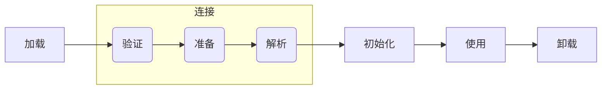

# 零、类文件结构

方法区里存放着类的版本，字段，方法，接口和常量池等。

## 0.1 ClassFile结构

Class文件格式采用一种类似于C语言结构体的伪结构来存储数据，包含__两种数据类型__。

```txt
ClassFile {
    u4 magic; 
    u2 minor_version; 
    u2 major_version; 
    u2 constant_pool_count; 
    cp_info constant_pool[constant_pool_count-1];
    u2 access_flags; 
    u2 this_class; 
    u2 super_class; 
    u2 interfaces_count; 
    u2 interfaces[interfaces_count]; 
    u2 fields_count; 
    field_info fields[fields_count]; 
    u2 methods_count; 
    method_info methods[methods_count]; 
    u2 attributes_count; 
    attribute_info attributes[attributes_count]; 
}
```

- __无符号数__：类型有u1、u2、u4、u8分别代表1个字节、2个字节、4个字节、8个字节
- __表__： 表是多个无符号数或者其他表组合而成的复合数据，如：cp_info constant_pool[constant_pool_count-1]就是一个表结构的数据。

方法区里的Class文件信息

| 名称 | 说明 | 长度 |
| ---- | ---- | ---- |
| magic | 魔数 | [u4，1] |
| minor_version | 副版本号 | [u2，1] |
| major_version | 主版本号 | [u2，1] |
| constant_pool_count | 常量池计数器 | [u2，1] |
| constant_pool | 常量池 | [cp_info，constant_pool_count - 1] |
| access_flags | 访问标志 | [u2，1] |
| this_class | 类索引 | [u2，1] |
| super_class | 父类索引 | [u2，1] |
| interfaces_count | 接口计数器 | [u2，1] |
| interfaces | 接口 | [u2，interfaces_count] |
| fields_count | 字段计数器 | [u2，1] |
| fields | 字段 | [field_info，fields_count] |
| methods_count | 方法计数器 | [u2，1] |
| methods | 方法 | [method_info，methods_count] |
| attribute_count | 属性计数器 | [u2，1] |
| attributes | 属性 | [attribute_info，attributes_count] |

源码

```java
public class TestClass {
    private static final String TEST = "test string";
}
```
二进制文件

```text
  Offset: 00 01 02 03 04 05 06 07 08 09 0A 0B 0C 0D 0E 0F 	
00000000: CA FE BA BE 00 00 00 34 00 15 0A 00 03 00 11 07    J~:>...4........
00000010: 00 12 07 00 13 01 00 04 54 45 53 54 01 00 12 4C    ........TEST...L
00000020: 6A 61 76 61 2F 6C 61 6E 67 2F 53 74 72 69 6E 67    java/lang/String
00000030: 3B 01 00 0D 43 6F 6E 73 74 61 6E 74 56 61 6C 75    ;...ConstantValu
00000040: 65 08 00 14 01 00 06 3C 69 6E 69 74 3E 01 00 03    e......<init>...
00000050: 28 29 56 01 00 04 43 6F 64 65 01 00 0F 4C 69 6E    ()V...Code...Lin
00000060: 65 4E 75 6D 62 65 72 54 61 62 6C 65 01 00 12 4C    eNumberTable...L
00000070: 6F 63 61 6C 56 61 72 69 61 62 6C 65 54 61 62 6C    ocalVariableTabl
00000080: 65 01 00 04 74 68 69 73 01 00 0B 4C 54 65 73 74    e...this...LTest
00000090: 43 6C 61 73 73 3B 01 00 0A 53 6F 75 72 63 65 46    Class;...SourceF
000000a0: 69 6C 65 01 00 0E 54 65 73 74 43 6C 61 73 73 2E    ile...TestClass.
000000b0: 6A 61 76 61 0C 00 08 00 09 01 00 09 54 65 73 74    java........Test
000000c0: 43 6C 61 73 73 01 00 10 6A 61 76 61 2F 6C 61 6E    Class...java/lan
000000d0: 67 2F 4F 62 6A 65 63 74 01 00 0B 74 65 73 74 20    g/Object...test.
000000e0: 73 74 72 69 6E 67 00 21 00 02 00 03 00 00 00 01    string.!........
000000f0: 00 1A 00 04 00 05 00 01 00 06 00 00 00 02 00 07    ................
00000100: 00 01 00 01 00 08 00 09 00 01 00 0A 00 00 00 2F    .............../
00000110: 00 01 00 01 00 00 00 05 2A B7 00 01 B1 00 00 00    ........*7..1...
00000120: 02 00 0B 00 00 00 06 00 01 00 00 00 01 00 0C 00    ................
00000130: 00 00 0C 00 01 00 00 00 05 00 0D 00 0E 00 00 00    ................
00000140: 01 00 0F 00 00 00 02 00 10                         .........
```


## 0.2 魔数&副版本号&主版本号

魔数是用来标识这支文件是能被虚拟机所接受的Class文件。魔数值固定为__0xCAFEBABE__，不会改变。

> 由于文件扩展名是可以随意修改的，因此，很多文件都会使用魔数作为文件标识，如gif或者jpeg等在头文件中都存在魔数。

`CA FE BA BE`魔数

`00 00 00 34`副版本号+主版本号

## 0.3 常量池

例如，constant_pool_count值为18，由于常量池容量计数是从1开始的，0用作表示“不引用任何对象”，因此，常量个数为17个(constant_pool_count - 1)

constant_pool存放常量信息的结构体就是cp_info
cp_info

```txt
cp_info { 
    u1 tag; 
    u1 info[]; 
}
```
tag表示常量的类型，info[]代表tag类型所属的表项。


# 一、类加载的五个过程

加载、连接[验证、准备、解析]、初始化、使用、卸载


类的加载、连接和初始化过程都是在__程序运行期__完成的，从而通过牺牲一些性能开销来换取Java程序的高度灵活性。

## 1.1 加载，Loading

根据查找路径找到相应的`.class`文件，然后导入。

类的加载方式分为`隐式加载`和`显式加载`两种。
1. 通过__类的全限定名__来获取定义此类的__二进制字节流__。
2. 将这个字节流所代表的__静态存储结构__转化为__方法区__的__运行时数据结构__。
3. 在内存中生成一个代表这个类的`java.lang.Class`对象，作为方法区这个类的各种数据的访问入口。

### 1.1.1 隐式加载

指的是程序在使用`new`关键词创建对象时，会隐式的调用类的加载器把对应的类加载到 JVM 中。

### 1.1.2 显示加载

指的是通过直接调用`Class.forName(...)`方法来把所需的类加载到 JVM 中。

## 1.2 连接，Linking

将加载到 JVM 中的二进制字节流的类数据信息合并到 JVM 的运行时状态中，经由__验证、准备和解析__三个阶段。

### 1.2.1 验证，Verification

检查加载的class文件的正确性。

为了确保`.class`文件的字节流中包含的信息符合当前虚拟机的要求，并且不会危害虚拟机自身的安全。

#### 1.2.1.1 文件格式验证

> a. 魔数`magic`是否以`0xCAFEBABE`开头。
>
> b. 次版本号`minor_version`、主版本号`major_version`是否在当前虚拟机处理范围之内。
>
> c. 常量池`constant_pool`的常量中是否有不被支持的常量类型（检查常量`cp_info.tag`标志）。
>
> d. 指向常量的各种索引值中是否有指向不存在的常量或不符合类型的常量。
>
> e. 常量`CONSTANT_Utf8_info`是否有不符合 Utf8 编码的数据。
>
> f. Class文件中各个部分及文件本身是否有被删除的或附加的其他信息。

保证输入的字节流能正确地解析并存储于方法区之内，且格式上符合描述一个Java类型信息的要求。只有保证二进制字节流通过了该验证后，它才会进入内存的方法区中进行存储，所以后续3个验证阶段全部是基于方法区而不是字节流。

#### 1.2.1.2 元数据验证

对类的元数据信息进行 语义校验，保证不存在不符合Java语言规范的元数据信息。

> a.类是否有父类（除了`java.lang.Object`之外，所有类都应当有父类）；
>
> b.类是否继承了不允许被继承的类（被final修饰的类）；
>
> c.如果这个类不是抽象类，是否实现了其父类或接口之中所要求实现的所有方法；
>
> d.类中的字段、方法是否与父类产生矛盾（例如，覆盖了父类的final字段，或者出现不符合规则的方法重载，例如方法参数都一致，但返回值类型却不同，等）。

#### 1.2.1.3 字节码验证

通过数据流和控制流分析，确定程序语义是合法的、符合逻辑的。

这个阶段将对类的方法体进行校验分析，保证被校验类的方法在运行时不会产生危害虚拟机安全的事件。

> a.保证任意时刻操作数栈的数据类型与指令代码序列都能配合工作，例如，在操作数栈放置了一个`int`类型的数据，使用时却按`long`类型来加载入本地变量表中；
>
> b.保证跳转指令不会跳转到方法体以外的字节码指令上；
>
> c.保证方法体中的类型转换是有效的，例如，可以把一个子类对象赋值给父类数据类型，但是把父类对象赋值给子类数据类型，甚至把对象赋值给与它毫无继承关系、完全不相干的一个数据类型，则是危险不合法的。

Halting Problem[图灵停机问题]：通过程序去校验程序逻辑是无法做到绝对准确的——不能通过程序准确的检查出程序是否能在有限时间之内结束运行。

#### 1.2.1.4 符号引用验证

符号引用验证可以看作是类对自身以外（常量池中的各种符号引用）的信息进行匹配性校验。

> a.符号引用中 通过字符串描述的全限定名 是否能够找到对应的类；
>
> b.在指定类中是否存在符合方法的字段描述符以及简单名称所描述的方法和字段；
>
> c.符号引用中的类、字段、方法的访问性（`private、protected、public、default`）是否可被当前类访问。

确保解析动作能正常执行，如果无法通过符号引用验证，那么将会抛出一个`java.lang.IncompatibleClassChangeError`异常的子类。

(2.2) 准备，Preparation，给类中的静态变量分配内存空间。

变量所使用的内存都将在方法区中进行分配。

> a.为类变量（静态变量）分配内存；
> b.设置类变量初始值，通常情况下零值。

进行内存分配的仅包括类变量（被`static`修饰的变量），而不包括实例变量，实例变量将会在对象实例化的时候随着对象一起分配在 Java堆（Heap） 中。

(2.3) 解析，Resolution，虚拟机将常量池中的符号引用替换成直接引用的过程。

符号引用就理解为一个标示，而直接引用直接指向内存中的地址。

符号引用：以一组符号来描述所引用的目标，符号可以是任何形式的字面量，只要使用时能 无歧义 地定位到目标即可。

与虚拟机实现的内存布局无关，因为符号引用的字面量形式明确定义在Java虚拟机规范的Class文件格式中，所以即使各种虚拟机实现的内存布局不同，但是能接受符号引用都是一致的。

直接引用：可以是直接指向目标的指针、相对偏移量或是一个能间接定位到目标的句柄。如果有了直接引用，那么引用的目标一定是已经存在于内存中。

与虚拟机实现的内存布局相关，同一个符号引用在不同虚拟机实例上翻译出来的直接引用一般不同。

JVM 会根据需要来判断，是在类被加载器加载时就对常量池中的符号引用进行解析，还是等到一个符号引用将要被使用前才去解析。

有七类符号及其对应在常量池的七种常量类型
类或接口(CONSTANT_Class_info)
字段(CONSTANT_Fieldref_info)
类方法(CONSTANT_Methodref_info)
接口方法(CONSTANT_InterfaceMethodref_info)
方法类型(CONSTANT_MethodType_info)
方法句柄(CONSTANT_MethodHandle_info)
调用点限定符(CONSTANT_InvokeDynamic_info)
举例，

类或接口的解析

设当前代码所处的为类D，把一个从未解析过的符号引用N解析为一个类或接口C的直接引用，解析过程分三步：

> 若C不是数组类型：JVM将会把代表N的全限定名传递给D类加载器去加载这个类C。在加载过程中，由于元数据验证、字节码验证的需要，又可能触发其他相关类的加载动作。一旦这个加载过程出现了任何异常，解析过程就宣告失败。
> 若C是数组类型且数组元素类型为对象：JVM也会按照上述规则加载数组元素类型
> 若上述步骤无任何异常：此时C在JVM中已成为一个有效的类或接口，但在解析完成前还需进行符号引用验证，来确认D是否具备对C的访问权限。如果发现不具备访问权限，将抛出java.lang.IllegalAccessError异常


字段解析

首先解析字段表内class_index项中索引的CONSTANT_Class_info符号引用，也就是字段所属的类或接口的符号引用，如果解析完成，将这个字段所属的类或接口用C表示，虚拟机规范要求按照如下步骤对C进行后续字段的搜索。

> 如果C 本身就包含了简单名称和字段描述符都与目标相匹配的字段，则返回这个字段的直接引用，查找结束。
> 否则，如果C中实现了接口，将会按照继承关系从下往上递归搜索各个接口和它的父接口如果接口中包含了简单名称和字段描述符都与目标相匹配的字段，则返回这个字段的直接引用，查找结束。
> 否则，如果C 不是java.lang.Object的话，将会按照继承关系从下往上递归搜索其父类，如果在父类中包含了简单名称和字段描述符都与目标相匹配的字段，则返回这个字段的直接引用，查找结束。
> 否则，查找失败，抛出java.lang.NoSuchFieldError异常。

如果查找过程成功返回了引用，将会对这个字段进行权限验证，如果发现不具备对字段的访问权限，将抛出java.lang.IllegalAccessError异常。

如果有一个同名字段同时出现在C的接口和父类中，或者同时在自己的父类或多个接口中出现，那编译器可能拒绝编译，并提示”The field xxx is ambiguous”。

类方法解析

首先解析类方法表内class_index项中索引的CONSTANT_Class_info符号引用，也就是方法所属的类或接口的符号引用，如果解析完成，将这个类方法所属的类或接口用C表示，虚拟机规范要求按照如下步骤对C进行后续类方法的搜索。
（1）类方法和接口方法符号引用的常量类型定义是分开的，如果在类方法表中发现class_index中索引的C 是个接口，那就直接抛出java.lang.IncompatibleClassChangeError异常。
（2）如果通过了第一步，在类C 中查找是否有简单名称和描述符都与目标相匹配的方法，如果有则返回这个方法的直接引用，查找结束。
（3）否则，在类C的父类中递归查找是否有简单名称和描述符都与目标相匹配的方法，如果有则返回这个方法的直接引用，查找结束。
（4）否则，在类C实现的接口列表以及他们的父接口中递归查找是否有简单名称和描述符都与目标相匹配的方法，如果存在相匹配的方法，说明类C是一个抽象类这时查找结束，抛出java.lang.AbstractMethodError异常。
（5）否则，宣告方法查找失败，抛出java.lang.NoSuchMethodError

最后，如果查找成功返回了直接引用，将会对这个方法进行权限验证，如果发现不具备此方法的访问权限，则抛出java.lang.IllegalAccessError异常。

接口方法解析

首先解析接口方法表内class_index项中索引的CONSTANT_Class_info符号引用，也就是方法所属的类或接口的符号引用，如果解析完成，将这个接口方法所属的接口用C表示，虚拟机规范要求按照如下步骤对C进行后续接口方法的搜索。
（1）与类解析方法不同，如果在接口方法表中发现class_index中的索引C是个类而不是个接口，那就直接抛出java.lang.IncompatibleClassChangeError异常。
（2）否则，在接口C中查找是否有简单名称和描述符都与目标相匹配的方法，如果有则返回这个方法的直接引用，查找结束。
（3）否则，在接口C的父接口中递归查找，直到java.lang.Object类（查找范围包括Object类）为止，看是否有简单名称和描述符都与目标相匹配的方法，如果有则返回这个方法的直接引用，查找结束。
（4）否则，宣告方法查找失败，抛出java.lang.NoSuchMethodError。

(3) 初始化：对静态变量和静态代码块执行初始化工作。

初始化是指根据Java程序的设定去初始化类变量和其他资源，或者说是执行类构造器`<clinit>`的过程。

是类加载过程的最后一步，会开始真正执行类中定义的Java代码。而之前的类加载过程中，除了在『加载』阶段用户应用程序可通过自定义类加载器参与之外，其余阶段均由虚拟机主导和控制。

> `<clinit>()`方法是编译器自动收集类中所有 类变量的赋值动作 和 静态代码块（stataic{}） 而产生的方法（无论类变量和静态代码块的位置是什么样，都是先执行类变量的赋值动作，再执行静态代码块）。

是线程安全的，在多线程环境中被正确地加锁、同步。

对于类或接口来说是非必需的，如果一个类中没有静态语句块，也没有对变量的赋值操作，那么编译器可以不为这个类生成 clinit。

接口与类不同的是，执行接口的 clinit不需要先执行父接口的 clinit，只有当父接口中定义的变量使用时，父接口才会初始化。另外，接口的实现类在初始化时也一样不会执行接口的clinit

在虚拟机规范中，规定了有且只有五种情况必须立即对类进行『初始化』：
遇到new、getstatic、putstatic或invokestatic这4条字节码指令
使用java.lang.reflect包的方法对类进行反射调用的时候
当初始化一个类的时候，若发现其父类还未进行初始化，需先触发其父类的初始化
在虚拟机启动时，需指定一个要执行的主类，虚拟机会先初始化它
当使用JDK1.7的动态语言支持时，若一个java.lang.invoke.MethodHandle实例最后的解析结果为REF_getStatic、REF_putStatic、REF_invokeStatic的方法句柄，且这个方法句柄所对应的类未进行初始化，需先触发其初始化。

1.编译器收集的顺序是由语句在源文件中出现的顺序决定的，静态语句块中只能访问到定义在静态语句块之前的变量，而定义在它之后的变量，在前面的静态语句块可以赋值，但不能访问，代码解释如下：

public class Test {
    static {
        i = 0;                       //给变量赋值可以正常编译通过
        System.out.print(i);         //编译器会提示“非法向前引用”
        }
    static int i = 1;
}
2.初始化方法执行的顺序，虚拟机会保证在子类的初始化方法执行之前，父类的初始化方法已经执行完毕，因此在虚拟机中第一个被执行的类初始化方法一定是java.lang.Object。另外，也意味着父类中定义的静态语句块要优先于子类的变量赋值操作，例如：

static class Parent {
    public static int A = 1;
    static {
        A = 2;
        }
    }

static class Sub extends Parent {
    public static int B = A;
    }

public static void main(String[] args) {
    System.out.println(Sub.B);
    }
执行的结果。字段B的值将会是2而不是1。

3.clinit ()方法对于类或接口来说并不是必须的，如果一个类中没有静态语句块，也没有对变量的赋值操作，那么编译器可以不为这个类生成clinit()方法。

4.接口中不能使用静态语句块，但仍然有变量初始化的操作，因此接口与类一样都会生成clinit()方法，但与类不同的是，执行接口的初始化方法之前，不需要先执行父接口的初始化方法。只有当父接口中定义的变量使用时，才会执行父接口的初始化方法。另外，接口的实现类在初始化时也一样不会执行接口的clinit()方法。

5.虚拟机会保证一个类的clinit()方法在多线程环境中被正确的加锁、同步，如果多个线程同时去初始化一个类，那么只会有一个线程去执行这个类的clinit()方法，其他线程都需要阻塞等待，直到活动线程执行类初始化方法完毕。

(4) 使用，Using，

(5) 卸载，Unloading，

> 加载 - 验证 - 准备 - 初始化 - 卸载 这五个阶段的顺序是确定的，而 解析 可能为了支持Java的动态绑定会在 初始化 后才开始。

9. 双亲委派模型：Bootstrap ClassLoader、Extension ClassLoader、Application ClassLoader。

每个类加载器，都拥有一个独立的命名空间，它不仅用于加载类，还和这个类本身一起作为在JVM中的唯一标识。所以比较两个类是否相等，只要看它们是否由同一个类加载器加载，即使它们来源于同一个Class文件且被同一个JVM加载，只要加载它们的类加载器不同，这两个类就必定不相等

启动类加载器 Bootstrap ClassLoader：加载<JAVA_HOME>\lib目录下核心库、或被-Xbootclasspath参数所指定路径中的、且可被虚拟机识别的类库，由C++语言实现，是虚拟机自身的一部分。
扩展类加载器 Extension ClassLoader：加载<JAVA_HOME>\lib\ext目录下扩展包、或者被java.ext.dirs系统变量所指定的路径中的所有类库。
应用程序类加载器 Application ClassLoader：加载用户路径(classpath)上指定的类库

工作流程：
    当Application ClassLoader 收到一个类加载请求时，他首先不会自己去尝试加载这个类，而是将这个请求委派给父类加载器Extension ClassLoader去完成。  
    当Extension ClassLoader收到一个类加载请求时，他首先也不会自己去尝试加载这个类，而是将请求委派给父类加载器Bootstrap ClassLoader去完成。  
    如果Bootstrap ClassLoader加载失败(在<JAVA_HOME>\lib中未找到所需类)，就会让Extension ClassLoader尝试加载。  
    如果Extension ClassLoader也加载失败，就会使用Application ClassLoader加载。
    如果Application ClassLoader也加载失败，就会使用自定义加载器去尝试加载。  
    如果均加载失败，就会抛出ClassNotFoundException异常。 
实现过程：
    实现双亲委派模型的代码都集中在java.lang.ClassLoader的loadClass()方法中：  
    首先会检查请求加载的类是否已经被加载过；  
    若没有被加载过：  
    递归调用父类加载器的loadClass();  
    父类加载器为空后就使用启动类加载器加载；  
    如果父类加载器和启动类加载器均无法加载请求，则调用自身的加载功能。
优点：
Java类伴随其类加载器具备了带有优先级的层次关系，确保了在各种加载环境的加载顺序。  
保证了运行的安全性，防止不可信类扮演可信任的类。


虽然数组类不通过类加载器创建而是由JVM直接创建的，但仍与类加载器有密切关系，因为数组类的元素类型最终还要靠类加载器去创建